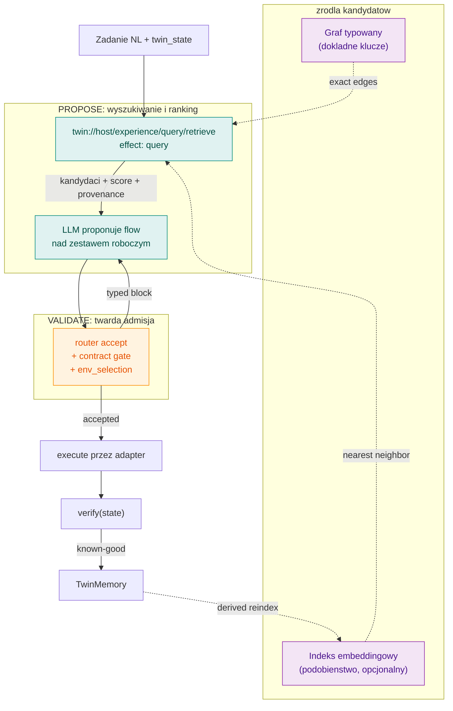
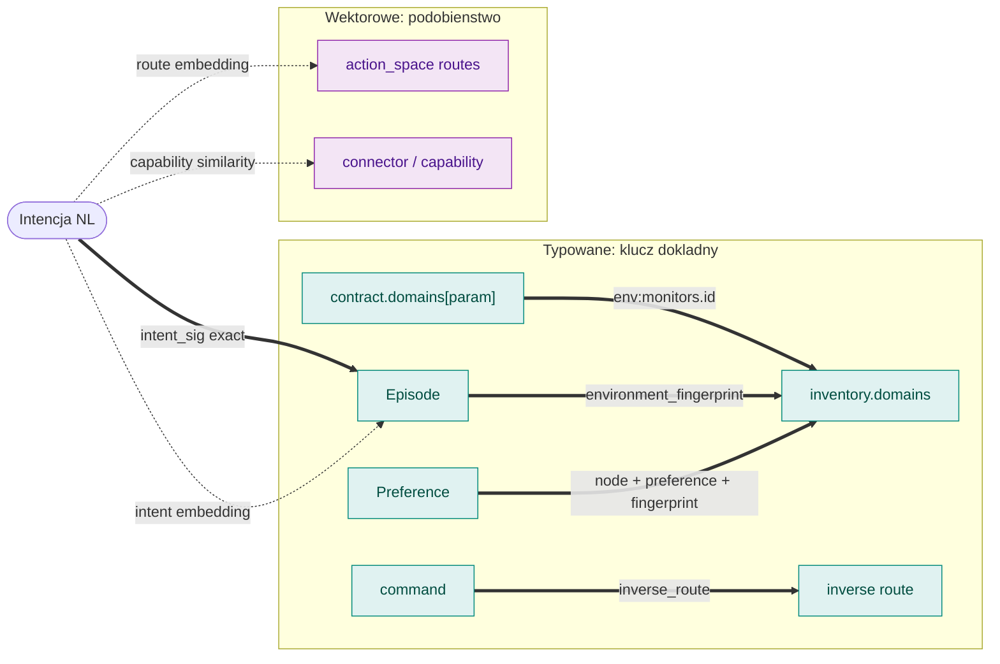
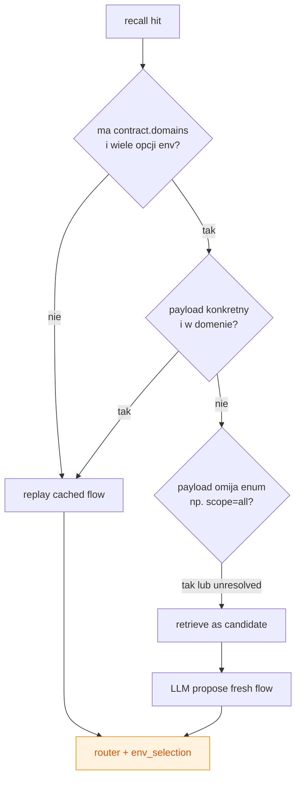
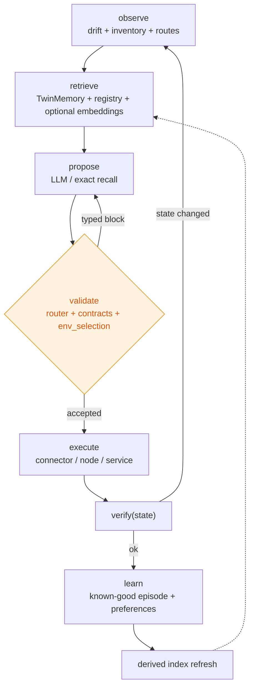
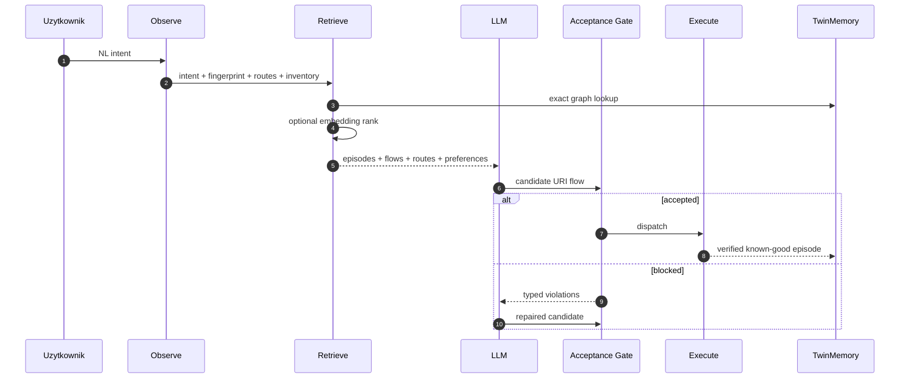

# Warstwa Wyszukiwania Doswiadczen

<!-- docs-nav -->
📖 **Dokumentacja urirun:** [← README](../README.md) · [Architektura](ARCHITECTURE.md) · [Autonomia](AUTONOMY_ARCHITECTURE.md) · **Retrieval** · [Komponenty](COMPONENTS.md) · [Decision Loop](DECISION_LOOP.md)
<!-- /docs-nav -->

Status: 2026-06-28.

Ten dokument opisuje warstwe, ktora znajduje kierunek dzialan operacyjnych:
jak z otwartego zadania NL, aktualnego stanu Digital Twin, pamieci epizodow i
registry wybrac maly zestaw kandydatow dla kroku `propose`.

To jest rozszerzenie [AUTONOMY_ARCHITECTURE.md](AUTONOMY_ARCHITECTURE.md).
Tamten dokument opisuje brame akceptacji. Ten dokument opisuje tylko warstwe
wyszukiwania przed brama i nie duplikuje jej reguly.

## Teza

Similarity nalezy do `PROPOSE`, nigdy do `VALIDATE`.

Embeddingi, exact recall i preferencje moga pomagac znalezc kandydatow:
epizody, flow, route'y i parametry. Nie moga uznac planu za dopuszczalny.
Dopuszczenie planu nadal robi deterministyczny kernel: router, kontrakty,
policy i `urirun_flow.env_selection`.

> Embeddingi proponuja, brama rozstrzyga. Retrieval miekki, admisja twarda.



## Kontrakt URI

Wlascicielem powierzchni retrieval jest `urirun-connector-twin`:

```text
twin://host/experience/query/retrieve
```

Jest to trasa `query`, tylko do odczytu. Wejscie:

```json
{
  "intent": "otworz linkedin i zrob zrzut ekranu",
  "fingerprint": "env-...",
  "env_fp": "env-...",
  "node": "host",
  "k": 5,
  "routes": []
}
```

Wyjscie:

```json
{
  "kind": "experience-retrieval",
  "episodes": [],
  "flows": [],
  "routes": [],
  "preferences": [],
  "index": {
    "kind": "derived",
    "source": "TwinMemory+routes",
    "embedding": {
      "configured": false,
      "provider": null,
      "degradedReason": "URIRUN_EXPERIENCE_EMBEDDER is not configured"
    }
  },
  "note": "retrieval returns candidates only; router/contract/env gates decide admissibility"
}
```

Implementacja: `urirun_connector_twin.experience.retrieve_experience`.
Handler URI: `urirun_connector_twin.core.experience_retrieve`.
Kontrakt trasy: `urirun_connector_twin.contracts.CONTRACTS`.

## Krawedzie

Warstwa retrieval laczy dwa typy krawedzi. Typowane krawedzie sa deterministyczne
i moga filtrowac kandydatow. Wektorowe krawedzie tylko rankuja.



| Laczy | Klucz | Typ | Stan |
| --- | --- | --- | --- |
| kontrakt parametru -> inventory | `env:monitors.id` | typowana | `urirun_flow.env_selection` |
| epizod -> srodowisko | `environment_fingerprint` | typowana | `TwinMemory` |
| preferencja -> srodowisko | `node + name + fingerprint` | typowana | `TwinMemory.recall_preference` |
| komenda -> cofniecie | `inverse_route` | typowana | `urirun_twin.reversible` |
| intencja NL -> epizod | `intent_sig` i opcjonalne embeddingi | mieszana | `retrieve_experience` |
| intencja NL -> route | embedding route text | wektorowa | opcjonalny embedder |
| capability -> connector | similarity | wektorowa | do ujednolicenia po router/registry |

## Recall A Retrieval

Recall moze ominac LLM tylko dla znanego, konkretnego i nadal dopuszczalnego
planu. Nie kazde trafienie w pamieci jest gotowym planem.

Najnowsza regula dla env-enum:

- recalled flow z konkretnym, poprawnym parametrem z aktualnej domeny moze byc
  shortcutem;
- recalled flow z `scope: all`, pusta wartoscia, defaultem albo wartoscia spoza
  domeny przy wielu opcjach srodowiska wraca do `retrieve -> propose`;
- invalid jawny payload, np. `monitor: 99` przy domenie `[1,2,3]`, jest blokowany
  jako `env-domain-invalid`.

Dzieki temu stary epizod "zrob zrzut wszystkich monitorow" nie wykona sie
slepo dla nowego promptu o trzecim monitorze. Taki epizod moze byc kandydatem dla
LLM, ale nie jest dowodem dopuszczenia.



## Miejsce W Petli Decyzyjnej

Retrieval jest jednym krokiem miedzy obserwacja a propozycja.



Sekwencja jednego zadania:



## Indeks

Indeks jest projekcja, nie zrodlem prawdy.

Zrodla prawdy:

- `TwinMemory.episode_store`;
- `TwinMemory.flow_store`;
- `TwinMemory.preference_store`;
- aktualne `routes` z registry/discovery;
- kontrakty tras.

Indeks pochodny moze byc przebudowany z tych zrodel. To ta sama dyscyplina co
w innych warstwach single-source: implementacja, kontrakt i pamiec sa pierwotne;
projekcje mozna skasowac i odtworzyc.

Embeddingi sa opcjonalne. Obecny mechanizm:

```text
URIRUN_EXPERIENCE_EMBEDDER=module:function
```

Funkcja dostaje liste tekstow i zwraca liste wektorow. Jesli nie jest
skonfigurowana albo zwroci bledny ksztalt, retrieval degraduje sie do exact
edges i zwraca `index.embedding.degradedReason`. Poprawnosc wykonania nie zalezy
od embeddera.

## Co Indeksowac

Indeksujemy tylko dane, ktore moga pomagac w `propose`:

- zweryfikowane epizody `outcome.status == "ok"`;
- flow, ktore nie sa zdegradowane;
- opisy route'ow z URI, `kind`, `inputSchema` i kontraktem;
- preferencje zgodne z node i fingerprintem.

Nie indeksujemy surowych nieudanych prob jako known-good. Bledy ida do recovery,
diagnostics i repair, a nie do pozytywnego retrieval.

## Granice Implementacyjne

Retrieval nie powinien importowac UI ani wykonania. Chat moze wyswietlic
kandydatow, ale nie powinien rozstrzygac ich poprawnosci. Router i flow moga
wolac retrieval jako `query`, ale wykonanie zaczyna sie dopiero po akceptacji
planu.

W aktualnym stanie trzeba jeszcze odchudzac:

- `chat_orchestrator.py` nadal jest duzym integratorem rozmowy, targetow,
  preview, env-enum wrapperow i wykonania;
- `_resolve_env_enum_flow` w chat orchestratorze powinien zostac cienkim
  delegatem do `urirun_flow.env_selection`, docelowo przeniesionym calkowicie do
  flow/router boundary;
- `task_planner.is_destructive` powinien zostac zastapiony odczytem
  `effect`/`reversible` z kontraktow;
- legacy `heuristic_plan_chat_request` zostaje tylko jawna sciezka debug/no-LLM,
  nie normalna autonomia.

Nie nalezy indeksowac obecnego splotu heurystyk jako docelowego modelu. Indeks
ma pomagac przy czystym szwie `retrieve -> propose -> validate`.

## Powiazane Dokumenty I Kod

- [Autonomia](AUTONOMY_ARCHITECTURE.md): LLM proponuje, kernel rozstrzyga.
- [Architektura](ARCHITECTURE.md): calosciowy podzial systemu.
- [Decision Loop](DECISION_LOOP.md): typed blocks, recovery i `nextIntent`.
- `urirun_connector_twin.experience.retrieve_experience`
- `urirun_connector_twin.core.experience_retrieve`
- `urirun_flow.env_selection`
- `urirun.host.chat_orchestrator._try_recall_gate`
