# System Architecture Analysis
<!-- generated in 0.02s -->

## Overview

- **Project**: /home/tom/github/if-uri/urirun
- **Primary Language**: python
- **Languages**: python: 254, json: 18, shell: 18, yaml: 5, txt: 5
- **Analysis Mode**: static
- **Total Functions**: 3030
- **Total Classes**: 63
- **Modules**: 333
- **Entry Points**: 1170

## Architecture by Module

### adapters.python.urirun.host.dashboard
- **Functions**: 634
- **File**: `dashboard.js`

### adapters.python.urirun.host.scanner
- **Functions**: 142
- **File**: `scanner.js`

### adapters.python.urirun_node.server
- **Functions**: 82
- **Classes**: 3
- **File**: `server.py`

### adapters.python.urirun_runtime.v2
- **Functions**: 81
- **Classes**: 3
- **File**: `v2.py`

### adapters.python.urirun.host.host_dashboard
- **Functions**: 70
- **File**: `host_dashboard.py`

### v1.js.urirun-v1
- **Functions**: 68
- **File**: `urirun-v1.js`

### adapters.python.urirun.host.node_cli
- **Functions**: 60
- **File**: `node_cli.py`

### adapters.python.urirun.host.chat_orchestrator
- **Functions**: 54
- **Classes**: 1
- **File**: `chat_orchestrator.py`

### adapters.python.urirun_connectors_toolkit.connector_lint
- **Functions**: 48
- **File**: `connector_lint.py`

### adapters.python.urirun_runtime._registry
- **Functions**: 47
- **File**: `_registry.py`

### adapters.python.urirun_twin.twin_store
- **Functions**: 45
- **Classes**: 3
- **File**: `twin_store.py`

### adapters.python.urirun.host.object_registry
- **Functions**: 45
- **File**: `object_registry.py`

### adapters.python.urirun_runtime.v2_cmds
- **Functions**: 44
- **File**: `v2_cmds.py`

### adapters.python.urirun_runtime._runtime
- **Functions**: 43
- **Classes**: 1
- **File**: `_runtime.py`

### adapters.python.urirun.host._dashboard_post_handlers
- **Functions**: 43
- **File**: `_dashboard_post_handlers.py`

### adapters.python.urirun_runtime._scan
- **Functions**: 41
- **File**: `_scan.py`

### adapters.python.urirun.host.dashboard_api
- **Functions**: 40
- **File**: `dashboard_api.py`

### adapters.python.urirun_node.manage
- **Functions**: 37
- **File**: `manage.py`

### adapters.python.urirun_node.client
- **Functions**: 35
- **Classes**: 1
- **File**: `client.py`

### adapters.python.urirun.host.discovery
- **Functions**: 35
- **File**: `discovery.py`

## Key Entry Points

Main execution flows into the system:

### adapters.python.urirun_runtime.cli._build_parser
- **Calls**: argparse.ArgumentParser, parser.add_argument, parser.add_subparsers, subparsers.add_parser, doctor_parser.add_argument, subparsers.add_parser, init_parser.add_argument, init_parser.add_argument

### adapters.python.urirun_runtime._scan.main
- **Calls**: adapters.python.urirun.host.dashboard.list, argparse.ArgumentParser, parser.add_subparsers, subparsers.add_parser, scan.add_argument, scan.add_argument, scan.add_argument, scan.add_argument

### adapters.python.urirun_runtime._registry.main
- **Calls**: argparse.ArgumentParser, parser.add_subparsers, subparsers.add_parser, discover.add_subparsers, discover_sub.add_parser, p_manifest.add_argument, p_manifest.add_argument, p_manifest.add_argument

### adapters.python.urirun_runtime.llm_runtime_loop.LlmRuntimeLoop.run
- **Calls**: adapters.python.urirun.host.dashboard.list, range, any, int, adapters.python.urirun_runtime.ticket_llm_context.save_llm_turn, os.environ.get, self.observe, self._prompt

### scripts.transport_swap_proof.main
- **Calls**: CallableTransport, subprocess.Popen, CallableTransport, scripts.test_pypi_install.print, scripts.test_pypi_install.print, scripts.test_pypi_install.print, scripts.transport_swap_proof.timed, scripts.transport_swap_proof.timed

### adapters.python.urirun.host.scanner_chat.chat_ask_phone_scanner
> Handle phone-scanner chat requests (start scanner, queue camera/torch actions).
- **Calls**: deps.ensure_phone_scanner_fn, torch_enabled_from_prompt, is_autonomous_scanner_prompt, scanner_flow_result, bool, int, float, float

### adapters.python.urirun.host.where_admin.where_am_i
> Zbierz: tożsamość węzła, display, okna, foreground i (opcjonalnie) świeży zrzut ekranu.
- **Calls**: adapters.python.urirun.host.where_admin._node_url, adapters.python.urirun.host.where_admin._invoke, adapters.python.urirun.host.where_admin._invoke, next, node.lower, adapters.python.urirun.host.where_admin._local_where, adapters.python.urirun.host.where_admin._host_identity, wl.get

### adapters.python.urirun_node.server.NodeHandler._get
- **Calls**: self.path.partition, adapters.python.urirun_node.server.send_json, None.encode, self.send_response, self.send_header, self.send_header, self.end_headers, self.wfile.write

### adapters.python.urirun.host.document_sync_chat.chat_ask_document_sync
> Handle document-sync chat requests.
- **Calls**: adapters.python.urirun.host.document_sync_chat.document_sync_node_from_prompt, selected_nodes_from_targets, adapters.python.urirun.host.dashboard.list, adapters.python.urirun.host.document_sync_chat._sync_ok_and_status, adapters.python.urirun.host.decision_loop.decision_loop_for_document_sync, sync_selected_targets.append, document_sync_dest_from_prompt, adapters.python.urirun.host.document_sync_chat._sync_execute_initial

### adapters.python.urirun._connector.Connector._build_cli_parser
> Build the connector argparse parser (one subcommand per route).
- **Calls**: argparse.ArgumentParser, parser.add_subparsers, sub.add_parser, sub.add_parser, sub.add_parser, self._add_route_arguments, None.get, None.split

### adapters.python.urirun_node.client.NodeClient.resolve_refs
> Chain steps: replace "$ref:<i>.<field.path>" with an earlier step's output.
- **Calls**: isinstance, isinstance, isinstance, re.match, re.sub, NodeClient.resolve_refs, NodeClient.resolve_refs, int

### adapters.python.urirun_connectors_toolkit.connect_catalog._cmd_show
- **Calls**: scripts.test_pypi_install.print, scripts.test_pypi_install.print, scripts.test_pypi_install.print, scripts.test_pypi_install.print, scripts.test_pypi_install.print, document.get, adapters.python.urirun_connectors_toolkit.connect_catalog.fetch_connector, adapters.python.urirun_connectors_toolkit.connect_catalog._emit_json

### adapters.python.urirun.host.ticket_meta.enrich
> Attach llm / node / process-preview / allow-deny to each ticket row (in place-ish).
- **Calls**: adapters.python.urirun.host.ticket_meta.load_meta, adapters.python.urirun.host.ticket_meta.session_llms, adapters.python.urirun.host.ticket_meta.scan_log_processes, os.uname, out.append, adapters.python.urirun.host.ticket_meta.load_digital_persons, meta.get, procs.get

### scripts.publish_release_chain.main
- **Calls**: argparse.ArgumentParser, ap.add_argument, ap.add_argument, ap.add_argument, ap.parse_args, scripts.publish_release_chain._load_packages, scripts.test_pypi_install.print, scripts.publish_release_chain._topo

### adapters.python.urirun_runtime.v2.run_local_function_subprocess
> Run a ``local-function`` handler in a fresh process via the shared
``python -m urirun.exec`` runner — for routes that want isolation (untrusted
code, 
- **Calls**: adapters.python.urirun_runtime.v2._subprocess_resolve_ref, adapters.python.urirun_runtime.v2._subprocess_resolve_cwd, None.strip, subprocess.run, adapters.python.urirun_runtime.v2._subprocess_parse_output, isinstance, ctx.get, isinstance

### adapters.python.urirun_runtime.secrets._provider_oauth
> ``secret://oauth/<provider>/<account>`` — a cached OAuth access token, with
refresh. The token bundle lives in the keyring under ``oauth:<provider>`` 
- **Calls**: location.partition, keyring.get_password, json.loads, urllib.request.Request, refreshed.get, keyring.set_password, str, KeyError

### adapters.python.urirun.host.node_cli.watch_command
> `urirun host watch <node>` — stream the node's live events (run/error) as URIs.
Reconnects automatically, replaying missed events via Last-Event-ID.
- **Calls**: adapters.python.urirun_node.config.host_config_for_args, adapters.python.urirun_node.config.node_url, getattr, getattr, bool, bool, sys.stderr.write, sys.stderr.flush

### adapters.python.urirun_runtime.errors.problem
> Project an error envelope to RFC 9457 ``application/problem+json``.
- **Calls**: dict, adapters.python.urirun_runtime.errors.category_meta, err.get, adapters.python.urirun_runtime.errors.classify, err.get, adapters.python.urirun_runtime.errors.error_code, err.get, err.get

### adapters.python.urirun_node.server.NodeHandler._handle_enroll
- **Calls**: adapters.python.urirun_node.server.read_raw, keyauth.verify_request, keyauth.token_matches, scripts.test_pypi_install.print, adapters.python.urirun_node.server.send_json, adapters.python.urirun_node.server.send_json, keyauth.available, adapters.python.urirun_node.server.send_json

### adapters.python.urirun_connectors_toolkit.connect_catalog._cmd_list
- **Calls**: adapters.python.urirun_connectors_toolkit.connect_catalog._connectors, getattr, max, adapters.python.urirun_connectors_toolkit.connect_catalog.fetch_catalog, adapters.python.urirun_connectors_toolkit.connect_catalog._emit_json, scripts.test_pypi_install.print, None.join, scripts.test_pypi_install.print

### adapters.python.urirun.host.cron_admin.action
> POST dispatch: {action: add|edit|remove, …}.
- **Calls**: None.strip, adapters.python.urirun.host.cron_admin.add_entry, adapters.python.urirun.host.cron_admin.edit_entry, adapters.python.urirun.host.cron_admin.remove_entry, str, str, str, str

### examples.matrix.verify.main
- **Calls**: contracts.get, sorted, None.removesuffix, adapters.python.urirun_runtime.v2_scan.validate_binding_document, examples.matrix.verify.essential, contracts.items, json.load, scripts.test_pypi_install.print

### adapters.python.urirun_node.transport.discover_node
- **Calls**: None.rstrip, adapters.python.urirun_node.transport._configured_node_kind, node.get, adapters.python.urirun_node.transport._configured_api_routes, info.update, adapters.python.urirun_node.transport.http_json, None.get, adapters.python.urirun_node.transport.http_json

### adapters.python.urirun_runtime.codegen.gen_command
- **Calls**: v2.load_registry_arg, getattr, scripts.test_pypi_install.print, adapters.python.urirun_runtime.codegen.proto_from_registry, getattr, None.write_text, None.write_text, scripts.test_pypi_install.print

### adapters.python.urirun.host.contracts.file_transfer_verification
> Return the standard verification contract for file-copy style URI flows.

`uploaded` means the remote write acknowledged the file. `verified` means th
- **Calls**: adapters.python.urirun.host.dashboard.list, set, set, adapters.python.urirun.host.contracts.verification_check, adapters.python.urirun.host.contracts.verification_check, all, len, len

### adapters.python.urirun.host.node_cli.run_command
> `urirun host run <node> <uri> [--payload JSON] [--stream]` — dispatch a URI to a
node; with --stream, start it async and print the node's live progres
- **Calls**: adapters.python.urirun_node.config.host_config_for_args, adapters.python.urirun_node.config.node_url, NodeClient, client.concretize, float, adapters.python.urirun.host.node_cli._maybe_ensure_scheme, adapters.python.urirun.host.node_cli._run_streamed, getattr

### adapters.python.urirun_node.server.NodeHandler._stamp_run_provenance
> Ensure every /run envelope has top-level provenance metadata.

Runtime executors already stamp ``result._meta`` when possible; this copies that
signal
- **Calls**: isinstance, meta.setdefault, meta.setdefault, meta.setdefault, meta.setdefault, meta.setdefault, isinstance, envelope.get

### adapters.python.urirun_connectors_toolkit.connector_lint.lint_kernel_symbols
> Static-scan a connector package for calls to kernel symbols absent from the contract.

Returns ``{"violations": [...], "ok": bool}`` where each violat
- **Calls**: Path, adapters.python.urirun_connectors_toolkit.connector_lint._connector_py_files, adapters.python.urirun_connectors_toolkit.connector_lint._kernel_direct_imports, adapters.python.urirun_connectors_toolkit.connector_lint._collect_kernel_imports, adapters.python.urirun_connectors_toolkit.connector_lint._kernel_attribute_accesses, len, path.read_text, ast.parse

### adapters.python.urirun_runtime.discovery.registry_for_uri
> Compile a registry for just the connector owning ``uri``'s scheme (+ builtins).

Falls back to full discovery (and refreshes the index) when the schem
- **Calls**: adapters.python.urirun_runtime.discovery._scheme_of, adapters.python.urirun_runtime.discovery.load_index, adapters.python.urirun.host.dashboard.list, adapters.python.urirun_runtime.discovery.build_index, v2.entry_point_bindings, bindings.extend, v2.compile_registry, None.get

### examples.node-file-transfer.fs_transfer.write_b64
- **Calls**: examples.node-file-transfer.fs_transfer._expand_path, final.with_name, tmp.write_bytes, tmp.replace, target.parent.mkdir, examples.node-file-transfer.fs_transfer._unique_path, base64.b64decode, str

## Process Flows

Key execution flows identified:

### Flow 1: _build_parser
```
_build_parser [adapters.python.urirun_runtime.cli]
```

### Flow 2: main
```
main [adapters.python.urirun_runtime._scan]
  └─ →> list
      └─> routesForNode
```

### Flow 3: run
```
run [adapters.python.urirun_runtime.llm_runtime_loop.LlmRuntimeLoop]
  └─ →> list
      └─> routesForNode
  └─ →> save_llm_turn
```

### Flow 4: chat_ask_phone_scanner
```
chat_ask_phone_scanner [adapters.python.urirun.host.scanner_chat]
```

### Flow 5: where_am_i
```
where_am_i [adapters.python.urirun.host.where_admin]
  └─> _node_url
  └─> _invoke
      └─> _node_url
```

### Flow 6: _get
```
_get [adapters.python.urirun_node.server.NodeHandler]
  └─ →> send_json
```

### Flow 7: chat_ask_document_sync
```
chat_ask_document_sync [adapters.python.urirun.host.document_sync_chat]
  └─> document_sync_node_from_prompt
      └─ →> prompt_node_match
  └─> _sync_ok_and_status
  └─ →> list
      └─> routesForNode
```

### Flow 8: _build_cli_parser
```
_build_cli_parser [adapters.python.urirun._connector.Connector]
```

### Flow 9: resolve_refs
```
resolve_refs [adapters.python.urirun_node.client.NodeClient]
```

### Flow 10: _cmd_show
```
_cmd_show [adapters.python.urirun_connectors_toolkit.connect_catalog]
  └─ →> print
  └─ →> print
```

## Key Classes

### adapters.python.urirun_node.server.NodeHandler
> The node's HTTP surface. State/config live on `self.server.ctx` (a NodeContext),
so this is a normal
- **Methods**: 38
- **Key Methods**: adapters.python.urirun_node.server.NodeHandler.ctx, adapters.python.urirun_node.server.NodeHandler.do_OPTIONS, adapters.python.urirun_node.server.NodeHandler._guarded, adapters.python.urirun_node.server.NodeHandler.do_GET, adapters.python.urirun_node.server.NodeHandler.do_POST, adapters.python.urirun_node.server.NodeHandler._health_payload, adapters.python.urirun_node.server.NodeHandler._routes_payload, adapters.python.urirun_node.server.NodeHandler._get, adapters.python.urirun_node.server.NodeHandler._get_errors, adapters.python.urirun_node.server.NodeHandler._post
- **Inherits**: BaseHTTPRequestHandler

### adapters.python.urirun_node.client.NodeClient
> Drive one urirun node: ``c = NodeClient("http://host:8765"); c.run(uri, payload)``.
- **Methods**: 33
- **Key Methods**: adapters.python.urirun_node.client.NodeClient.__init__, adapters.python.urirun_node.client.NodeClient._auth, adapters.python.urirun_node.client.NodeClient.routes, adapters.python.urirun_node.client.NodeClient.get, adapters.python.urirun_node.client.NodeClient.concretize, adapters.python.urirun_node.client.NodeClient.run, adapters.python.urirun_node.client.NodeClient.run_async, adapters.python.urirun_node.client.NodeClient.cancel, adapters.python.urirun_node.client.NodeClient.status, adapters.python.urirun_node.client.NodeClient.deploy

### adapters.python.urirun_twin.twin_store.TwinMemory
> Remembers the KNOWN-GOOD environment fingerprint per node (snapshot-on-success), so a later
run dete
- **Methods**: 24
- **Key Methods**: adapters.python.urirun_twin.twin_store.TwinMemory.remember, adapters.python.urirun_twin.twin_store.TwinMemory.known_good, adapters.python.urirun_twin.twin_store.TwinMemory.drift, adapters.python.urirun_twin.twin_store.TwinMemory.remember_flow, adapters.python.urirun_twin.twin_store.TwinMemory.recall_flow, adapters.python.urirun_twin.twin_store.TwinMemory.known_good_flows, adapters.python.urirun_twin.twin_store.TwinMemory.degraded_flows, adapters.python.urirun_twin.twin_store.TwinMemory.remember_episode, adapters.python.urirun_twin.twin_store.TwinMemory.known_good_episodes, adapters.python.urirun_twin.twin_store.TwinMemory.recall_episode

### adapters.python.urirun._connector.Connector
> Small convention helper for connector packages.

Connector authors can declare the package once and 
- **Methods**: 17
- **Key Methods**: adapters.python.urirun._connector.Connector.__post_init__, adapters.python.urirun._connector.Connector.uri, adapters.python.urirun._connector.Connector._meta, adapters.python.urirun._connector.Connector.command, adapters.python.urirun._connector.Connector.shell, adapters.python.urirun._connector.Connector.cli, adapters.python.urirun._connector.Connector._add_route_arguments, adapters.python.urirun._connector.Connector._build_cli_parser, adapters.python.urirun._connector.Connector._dispatch_cli, adapters.python.urirun._connector.Connector.handler

### adapters.python.urirun.connectors.connector_contract.ConnectorContractSuite
> pytest-compatible base class for connector contract tests.

Sub-class and set class attributes::

  
- **Methods**: 11
- **Key Methods**: adapters.python.urirun.connectors.connector_contract.ConnectorContractSuite.compile, adapters.python.urirun.connectors.connector_contract.ConnectorContractSuite.dispatch_dry, adapters.python.urirun.connectors.connector_contract.ConnectorContractSuite.dispatch_execute, adapters.python.urirun.connectors.connector_contract.ConnectorContractSuite.assert_ok, adapters.python.urirun.connectors.connector_contract.ConnectorContractSuite.assert_reply_shape, adapters.python.urirun.connectors.connector_contract.ConnectorContractSuite.test_bindings_validate, adapters.python.urirun.connectors.connector_contract.ConnectorContractSuite.test_bindings_compile, adapters.python.urirun.connectors.connector_contract.ConnectorContractSuite.test_bindings_serializable, adapters.python.urirun.connectors.connector_contract.ConnectorContractSuite.test_dry_run_routes_return_valid_reply_shape, adapters.python.urirun.connectors.connector_contract.ConnectorContractSuite.test_execute_cases

### adapters.python.urirun_twin.twin_store._NamespacedStore
> Wraps a JsonFileStore so all reads/writes go through a named sub-key.

``store["_flows"]["abc"]`` be
- **Methods**: 10
- **Key Methods**: adapters.python.urirun_twin.twin_store._NamespacedStore.__init__, adapters.python.urirun_twin.twin_store._NamespacedStore._bucket, adapters.python.urirun_twin.twin_store._NamespacedStore.get, adapters.python.urirun_twin.twin_store._NamespacedStore.__getitem__, adapters.python.urirun_twin.twin_store._NamespacedStore.__contains__, adapters.python.urirun_twin.twin_store._NamespacedStore.__setitem__, adapters.python.urirun_twin.twin_store._NamespacedStore.__delitem__, adapters.python.urirun_twin.twin_store._NamespacedStore.values, adapters.python.urirun_twin.twin_store._NamespacedStore.items, adapters.python.urirun_twin.twin_store._NamespacedStore.keys

### adapters.python.urirun_twin.twin_store.JsonFileStore
> A dict-like store that persists every write to a single JSON file (atomic replace), so a
TwinMemory 
- **Methods**: 7
- **Key Methods**: adapters.python.urirun_twin.twin_store.JsonFileStore.__init__, adapters.python.urirun_twin.twin_store.JsonFileStore.get, adapters.python.urirun_twin.twin_store.JsonFileStore.items, adapters.python.urirun_twin.twin_store.JsonFileStore.__getitem__, adapters.python.urirun_twin.twin_store.JsonFileStore.__contains__, adapters.python.urirun_twin.twin_store.JsonFileStore.__setitem__, adapters.python.urirun_twin.twin_store.JsonFileStore._flush

### adapters.python.urirun_node.server.EventHub
> In-memory pub/sub for a node's live event stream (SSE). Each subscriber gets a
bounded queue; publis
- **Methods**: 7
- **Key Methods**: adapters.python.urirun_node.server.EventHub.__init__, adapters.python.urirun_node.server.EventHub.publish, adapters.python.urirun_node.server.EventHub.subscribe, adapters.python.urirun_node.server.EventHub.unsubscribe, adapters.python.urirun_node.server.EventHub.replay_since, adapters.python.urirun_node.server.EventHub.current_id, adapters.python.urirun_node.server.EventHub.count

### adapters.python.urirun_runtime.worker.WorkerPool
> A single long-lived connector worker. Reuse across many URI calls.
- **Methods**: 6
- **Key Methods**: adapters.python.urirun_runtime.worker.WorkerPool.__init__, adapters.python.urirun_runtime.worker.WorkerPool.run_argv, adapters.python.urirun_runtime.worker.WorkerPool.run_uri, adapters.python.urirun_runtime.worker.WorkerPool.close, adapters.python.urirun_runtime.worker.WorkerPool.__enter__, adapters.python.urirun_runtime.worker.WorkerPool.__exit__

### adapters.python.urirun_runtime.secrets.SecretStr
> An opaque secret value. ``str``/``repr``/JSON show ``****``; ``reveal()``
returns the plaintext (cal
- **Methods**: 6
- **Key Methods**: adapters.python.urirun_runtime.secrets.SecretStr.__init__, adapters.python.urirun_runtime.secrets.SecretStr.reveal, adapters.python.urirun_runtime.secrets.SecretStr.ref, adapters.python.urirun_runtime.secrets.SecretStr.__str__, adapters.python.urirun_runtime.secrets.SecretStr.__repr__, adapters.python.urirun_runtime.secrets.SecretStr.__bool__

### adapters.php.Urirun.Urirun.Connector
- **Methods**: 5
- **Key Methods**: adapters.php.Urirun.Connector.__construct, adapters.php.Urirun.Connector.target, adapters.php.Urirun.Connector.command, adapters.php.Urirun.Connector.bindings, adapters.php.Urirun.Connector.bindingsJson

### adapters.python.urirun_runtime.worker.HandlerPool
> A single long-lived worker that runs ``local-function`` handlers by ref,
caching imports. Reuse acro
- **Methods**: 5
- **Key Methods**: adapters.python.urirun_runtime.worker.HandlerPool.__init__, adapters.python.urirun_runtime.worker.HandlerPool.run_ref, adapters.python.urirun_runtime.worker.HandlerPool.close, adapters.python.urirun_runtime.worker.HandlerPool.__enter__, adapters.python.urirun_runtime.worker.HandlerPool.__exit__

### adapters.python.urirun_runtime.worker.ConnectorPools
> A set of warm workers, one per connector, keyed by CLI ref. Lets a long-lived
server (e.g. ``node se
- **Methods**: 5
- **Key Methods**: adapters.python.urirun_runtime.worker.ConnectorPools.__init__, adapters.python.urirun_runtime.worker.ConnectorPools.run_route, adapters.python.urirun_runtime.worker.ConnectorPools._run_handler, adapters.python.urirun_runtime.worker.ConnectorPools._run_argv, adapters.python.urirun_runtime.worker.ConnectorPools.close

### adapters.java.Urirun.Urirun
- **Methods**: 4
- **Key Methods**: adapters.java.Urirun.Urirun.Connector, adapters.java.Urirun.Urirun.Connector, adapters.java.Urirun.Urirun.command, adapters.java.Urirun.Urirun.bindingsJson

### adapters.ts.urirun.Connector
- **Methods**: 4
- **Key Methods**: adapters.ts.urirun.Connector.command, adapters.ts.urirun.Connector.document, adapters.ts.urirun.Connector.toJSON, adapters.ts.urirun.Connector.connector

### adapters.python.urirun_runtime.progress.RunControl
> Live control for one in-flight run: a progress sink, a cancel flag, and the set of
child processes t
- **Methods**: 4
- **Key Methods**: adapters.python.urirun_runtime.progress.RunControl.__init__, adapters.python.urirun_runtime.progress.RunControl.emit, adapters.python.urirun_runtime.progress.RunControl.register_proc, adapters.python.urirun_runtime.progress.RunControl.kill

### adapters.ruby.urirun.Connector
- **Methods**: 4
- **Key Methods**: adapters.ruby.urirun.Connector.initialize, adapters.ruby.urirun.Connector.command, adapters.ruby.urirun.Connector.bindings, adapters.ruby.urirun.Connector.bindings_json

### adapters.python.urirun_runtime.llm_runtime_loop.LlmRuntimeLoop
> LLM-controlled ticket execution against URI runtime.
- **Methods**: 4
- **Key Methods**: adapters.python.urirun_runtime.llm_runtime_loop.LlmRuntimeLoop.__init__, adapters.python.urirun_runtime.llm_runtime_loop.LlmRuntimeLoop.observe, adapters.python.urirun_runtime.llm_runtime_loop.LlmRuntimeLoop._prompt, adapters.python.urirun_runtime.llm_runtime_loop.LlmRuntimeLoop.run

### adapters.python.urirun_twin.reversible.Connector
> The ADOPTION CONTRACT. A connector enters the engine by providing these three.
- **Methods**: 3
- **Key Methods**: adapters.python.urirun_twin.reversible.Connector.call, adapters.python.urirun_twin.reversible.Connector.scan_uri, adapters.python.urirun_twin.reversible.Connector.schema
- **Inherits**: Protocol

### adapters.python.urirun_twin.reversible.ReversibleProcess
> The engine: execute with the invariant, build the ledger, roll back with proof. It
knows NO connecto
- **Methods**: 3
- **Key Methods**: adapters.python.urirun_twin.reversible.ReversibleProcess.execute, adapters.python.urirun_twin.reversible.ReversibleProcess.rollback, adapters.python.urirun_twin.reversible.ReversibleProcess.rollback_flow

## Data Transformation Functions

Key functions that process and transform data:

### adapters.conformance._validate_contracts
> Validate each SDK's bindings; return the essential contracts and an error count.
- **Output to**: sys.path.insert, outputs.items, os.path.join, validate, adapters.conformance.essential

### adapters.js.parseUri
- **Output to**: adapters.js.String, adapters.js.match, adapters.js.Error, adapters.js.split, adapters.js.filter

### adapters.c.urirun.parse_target
- **Output to**: adapters.c.urirun.copy_token

### adapters.c.urirun.parse_segments

### adapters.c.urirun.urirun_parse

### adapters.python.urirun.node.doctor._parse_non_http_address
- **Output to**: urllib.parse.urlparse, _DEFAULT_PORT.get

### adapters.python.urirun.node.doctor.format_doctor_report
> Plain-text capability doctor report table.
- **Output to**: output.extend, None.join, rows.append, max, None.rstrip

### adapters.python.urirun_node._artifacts._decode_base64_artifact
- **Output to**: value.strip, text.startswith, text.partition, len, base64.b64decode

### adapters.python.urirun_node.formatting.format_table
- **Output to**: output.extend, None.join, max, None.rstrip, line

### adapters.python.urirun_node.formatting.format_nodes
- **Output to**: adapters.python.urirun_node.formatting.format_table, len, len, rows.append, None.get

### adapters.python.urirun_node.formatting.format_routes
- **Output to**: adapters.python.urirun_node.formatting.format_table, sorted, safe_route, route.get, route.get

### adapters.python.urirun_node.formatting.format_tickets
- **Output to**: adapters.python.urirun_node.formatting.format_table, ticket.get, ticket.get, None.get, None.get

### adapters.python.urirun_node.transport.parse_ports
- **Output to**: spec.split, part.strip, part.partition, out.extend, range

### adapters.python.urirun_node.transport._parse_sse_line
- **Output to**: line.startswith, ev.setdefault, json.loads, line.startswith, None.strip

### adapters.python.urirun_twin.reversible.parse
> ``scheme://node/path`` -> (scheme, node, path).
- **Output to**: uri.split, rest.partition

### adapters.python.urirun_connectors_toolkit.connector_lint._format_secret_reads
- **Output to**: sr.get, sr.get, lines.append, lines.append, sr.get

### adapters.python.urirun_connectors_toolkit.connector_lint._format_drift
- **Output to**: lines.append, lines.append, lines.append, lines.append

### adapters.python.urirun_connectors_toolkit.connector_lint._format_duplication
- **Output to**: lines.append, None.join

### adapters.python.urirun_connectors_toolkit.connector_lint._format_report
- **Output to**: lines.append, lines.extend, lines.append, lines.append, lines.extend

### adapters.python.urirun.connectors.connector_contract.ConnectorContractSuite.test_bindings_validate
> The bindings document must pass urirun.validate_binding_document.
- **Output to**: urirun.validate_binding_document, result.get, result.get

### adapters.python.urirun_runtime.v1._run_process
- **Output to**: config.get, config.get, subprocess.run, policy.get, progress.active

### adapters.python.urirun_runtime.v1._run_process_streaming
- **Output to**: subprocess.Popen, progress.register_proc, threading.Timer, timer.start, enumerate

### adapters.python.urirun_runtime.v1._build_v1_parser
- **Output to**: argparse.ArgumentParser, parser.add_subparsers, subparsers.add_parser, add_source, run_parser.add_argument

### adapters.python.urirun_runtime.v2_scan.parse_param_declaration
> Parse a compact CLI param declaration.

Supported forms:
- ``name``
- ``name:type``
- ``name:type:re
- **Output to**: left.split, None.strip, None.get, declaration.split, ValueError

### adapters.python.urirun_runtime.v2_scan.validate_binding_document
- **Output to**: adapters.python.urirun_runtime.v1.expand_bindings, binding.get, config.get, set, set

## Behavioral Patterns

### recursion__placeholders_in
- **Type**: recursion
- **Confidence**: 0.90
- **Functions**: adapters.python.urirun_runtime.v2_scan._placeholders_in

### recursion__schema_allows_null
- **Type**: recursion
- **Confidence**: 0.90
- **Functions**: adapters.python.urirun_runtime.v2._schema_allows_null

### recursion__apply_defaults
- **Type**: recursion
- **Confidence**: 0.90
- **Functions**: adapters.python.urirun_runtime.v2._apply_defaults

### recursion__resolve_refs
- **Type**: recursion
- **Confidence**: 0.90
- **Functions**: adapters.python.urirun_runtime.agent._resolve_refs

### recursion__walk_route_entries
- **Type**: recursion
- **Confidence**: 0.90
- **Functions**: adapters.python.urirun_runtime._registry._walk_route_entries

### recursion_redact
- **Type**: recursion
- **Confidence**: 0.90
- **Functions**: adapters.python.urirun_runtime.secrets.redact

### recursion_short_value
- **Type**: recursion
- **Confidence**: 0.90
- **Functions**: adapters.python.urirun.host.fs_transfer.short_value

### recursion__find_image_paths
- **Type**: recursion
- **Confidence**: 0.90
- **Functions**: adapters.python.urirun.host.dashboard_api._find_image_paths

### recursion__fetch_render
- **Type**: recursion
- **Confidence**: 0.90
- **Functions**: adapters.python.urirun_runtime._runtime._fetch_render

### recursion__uri_action_lookup
- **Type**: recursion
- **Confidence**: 0.90
- **Functions**: adapters.python.urirun.host.host_dashboard._uri_action_lookup

### state_machine_Urirun
- **Type**: state_machine
- **Confidence**: 0.70
- **Functions**: adapters.java.Urirun.Urirun.Connector, adapters.java.Urirun.Urirun.Connector, adapters.java.Urirun.Urirun.command, adapters.java.Urirun.Urirun.bindingsJson

### state_machine_Connector
- **Type**: state_machine
- **Confidence**: 0.70
- **Functions**: adapters.ts.urirun.Connector.command, adapters.ts.urirun.Connector.document, adapters.ts.urirun.Connector.toJSON, adapters.ts.urirun.Connector.connector

### state_machine_Connector
- **Type**: state_machine
- **Confidence**: 0.70
- **Functions**: adapters.php.Urirun.Connector.__construct, adapters.php.Urirun.Connector.target, adapters.php.Urirun.Connector.command, adapters.php.Urirun.Connector.bindings, adapters.php.Urirun.Connector.bindingsJson

### state_machine_Connector
- **Type**: state_machine
- **Confidence**: 0.70
- **Functions**: adapters.python.urirun_twin.reversible.Connector.call, adapters.python.urirun_twin.reversible.Connector.scan_uri, adapters.python.urirun_twin.reversible.Connector.schema

### state_machine_Backend
- **Type**: state_machine
- **Confidence**: 0.70
- **Functions**: adapters.python.urirun_connectors_toolkit.backend_registry.Backend.missing, adapters.python.urirun_connectors_toolkit.backend_registry.Backend.platform_ok, adapters.python.urirun_connectors_toolkit.backend_registry.Backend.available

## Public API Surface

Functions exposed as public API (no underscore prefix):

- `adapters.python.urirun.host.work_queue.tickets` - 60 calls
- `adapters.python.urirun_runtime._scan.main` - 59 calls
- `adapters.python.urirun_runtime._registry.main` - 56 calls
- `adapters.python.scripts.dev_deps_doctor.diagnose` - 47 calls
- `adapters.python.urirun_runtime.environment_topology.format_topology_for_llm` - 43 calls
- `scripts.extraction_audit.print_report` - 36 calls
- `adapters.python.urirun_runtime.llm_runtime_loop.LlmRuntimeLoop.run` - 34 calls
- `adapters.python.urirun.host.work_queue.active_tickets` - 31 calls
- `adapters.python.urirun.host.node_cli.copy_id_command` - 30 calls
- `scripts.transport_swap_proof.main` - 29 calls
- `adapters.python.urirun.host.scanner_chat.chat_ask_phone_scanner` - 28 calls
- `adapters.python.urirun.host.where_admin.where_am_i` - 28 calls
- `adapters.python.urirun_connectors_toolkit.connector_lint.verify_connector` - 27 calls
- `adapters.python.urirun.host.document_sync_chat.chat_ask_document_sync` - 27 calls
- `adapters.python.urirun_runtime.llm_runtime_loop.parse_llm_action` - 27 calls
- `adapters.python.urirun.host.host_dashboard.serve` - 27 calls
- `adapters.python.urirun_node.client.NodeClient.resolve_refs` - 26 calls
- `adapters.python.urirun.host.dashboard_api.chat_history` - 26 calls
- `adapters.python.urirun.host.node_api.execute_http_request` - 26 calls
- `adapters.python.urirun.host.ticket_meta.enrich` - 25 calls
- `adapters.python.urirun_node.server.apply_deploy` - 25 calls
- `scripts.publish_release_chain.main` - 24 calls
- `adapters.python.urirun_connectors_toolkit.resolver.resolve` - 24 calls
- `adapters.python.urirun_runtime.v2_scan.validate_binding_document` - 24 calls
- `adapters.python.urirun_runtime.v2.run_local_function_subprocess` - 24 calls
- `adapters.python.urirun.host.node_cli.watch_command` - 24 calls
- `adapters.python.urirun.testing.smoke` - 23 calls
- `adapters.python.urirun.host.work_queue.ticket_action` - 23 calls
- `adapters.python.urirun.host.work_console.koru_log_tail` - 23 calls
- `adapters.python.urirun.node.doctor.format_doctor_report` - 22 calls
- `adapters.python.urirun_twin.twin_store.environment_fingerprint` - 22 calls
- `adapters.python.urirun_runtime.errors.problem` - 22 calls
- `adapters.python.urirun_runtime.process_standard.execute_plan` - 22 calls
- `adapters.python.urirun_runtime._runtime.run` - 22 calls
- `adapters.python.urirun.host.work_queue.work_status` - 22 calls
- `adapters.python.urirun.host.host_db.search_records` - 21 calls
- `adapters.python.urirun.host.cron_admin.action` - 21 calls
- `adapters.python.urirun.host.ticket_meta.load_digital_persons` - 21 calls
- `examples.matrix.verify.main` - 20 calls
- `adapters.python.urirun_node.transport.discover_node` - 20 calls

## System Interactions

How components interact:

```mermaid
graph TD
    _build_parser --> ArgumentParser
    _build_parser --> add_argument
    _build_parser --> add_subparsers
    _build_parser --> add_parser
    main --> list
    main --> ArgumentParser
    main --> add_subparsers
    main --> add_parser
    main --> add_argument
    run --> list
    run --> range
    run --> any
    run --> int
    run --> save_llm_turn
    main --> CallableTransport
    main --> Popen
    main --> print
    chat_ask_phone_scann --> ensure_phone_scanner
    chat_ask_phone_scann --> torch_enabled_from_p
    chat_ask_phone_scann --> is_autonomous_scanne
    chat_ask_phone_scann --> scanner_flow_result
    chat_ask_phone_scann --> bool
    where_am_i --> _node_url
    where_am_i --> _invoke
    where_am_i --> next
    where_am_i --> lower
    _get --> partition
    _get --> send_json
    _get --> encode
    _get --> send_response
```



## Reverse Engineering Guidelines

1. **Entry Points**: Start analysis from the entry points listed above
2. **Core Logic**: Focus on classes with many methods
3. **Data Flow**: Follow data transformation functions
4. **Process Flows**: Use the flow diagrams for execution paths
5. **API Surface**: Public API functions reveal the interface

## Context for LLM

Maintain the identified architectural patterns and public API surface when suggesting changes.